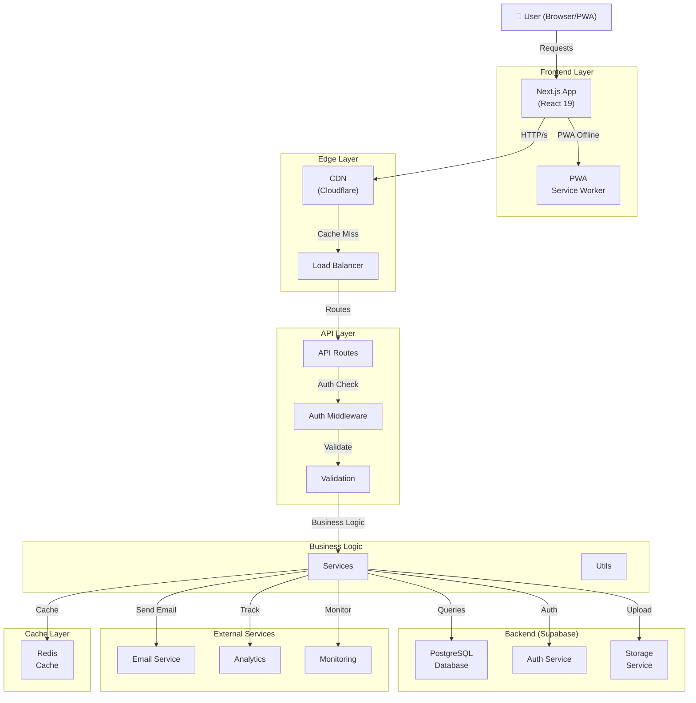

# Architecture Documentation - REACH Church Vietnam

**Version:** 1.0.0  
**Last Updated:** June 2026

---

## Table of Contents

1. [System Architecture](#system-architecture)
2. [Technology Stack](#technology-stack)
3. [Component Diagram](#component-diagram)
4. [Data Flow](#data-flow)
5. [Database Schema](#database-schema)
6. [Authentication Flow](#authentication-flow)
7. [Deployment Architecture](#deployment-architecture)
8. [Scaling Strategy](#scaling-strategy)

---

## System Architecture

### Overview

REACH Church Vietnam uses a **modern, cloud-native, serverless-first architecture** designed for scalability, maintainability, and performance.

```
┌─────────────────────────────────────────────────────────────────┐
│                         CDN (Cloudflare)                        │
│              Static Assets + Edge Caching                       │
└─────────────────────────────────────────────────────────────────┘
                              ↓
┌─────────────────────────────────────────────────────────────────┐
│                    Next.js App (Vercel/K8s)                     │
│              - App Router                                       │
│              - Server Components                                │
│              - API Routes                                       │
│              - Middleware (Auth, CORS, Logging)                 │
└─────────────────────────────────────────────────────────────────┘
                              ↓
┌─────────────────────────────────────────────────────────────────┐
│                  API Gateway / Load Balancer                    │
│                    (Nginx / AWS ALB)                            │
└─────────────────────────────────────────────────────────────────┘
                              ↓
        ┌─────────────────────┬──────────────────────┐
        ↓                     ↓                      ↓
┌──────────────┐    ┌──────────────────┐   ┌───────────────┐
│   Supabase   │    │   Third-party    │   │    Worker     │
│ (PostgreSQL  │    │   Services       │   │   Jobs (Bull) │
│ + Auth)      │    │ - SendGrid       │   │               │
│              │    │ - Stripe         │   │               │
│              │    │ - YouTube        │   │               │
└──────────────┘    └──────────────────┘   └───────────────┘
        ↓                                          ↓
┌──────────────┐                     ┌──────────────────────┐
│  Storage     │                     │  Message Queue       │
│  (S3/GCS)    │                     │  (Redis)             │
│              │                     │  - Cache             │
│              │                     │  - Sessions          │
└──────────────┘                     │  - Jobs              │
                                     └──────────────────────┘
```

---

## Technology Stack

### Frontend Layer

```
Browser / Mobile PWA
    ↓
┌─────────────────────────────────┐
│ React 19 Components             │
├─────────────────────────────────┤
│ TypeScript 5 (Type Safety)      │
├─────────────────────────────────┤
│ Next.js 16 (SSR, App Router)    │
├─────────────────────────────────┤
│ Styling: CSS Modules + Tailwind │
├─────────────────────────────────┤
│ Icons: Lucide React             │
├─────────────────────────────────┤
│ Editor: react-quill-new         │
└─────────────────────────────────┘
```

### Application Layer

```
┌─────────────────────────────────┐
│ API Routes (Next.js)            │
│ - REST endpoints                │
│ - Middleware                    │
│ - Request validation            │
├─────────────────────────────────┤
│ Business Logic                  │
│ - lib/services                  │
│ - Utilities                     │
│ - Helpers                       │
├─────────────────────────────────┤
│ Auth Context (React)            │
│ - User state management         │
│ - Session handling              │
│ - Role-based access             │
└─────────────────────────────────┘
```

### Backend Layer

```
┌─────────────────────────────────┐
│ Supabase (Backend as a Service) │
├─────────────────────────────────┤
│ PostgreSQL Database             │
│ - Structured data storage       │
│ - ACID transactions             │
│ - Row-level security            │
├─────────────────────────────────┤
│ Authentication Service          │
│ - Email/password auth           │
│ - JWT tokens                    │
│ - Session management            │
├─────────────────────────────────┤
│ Storage Service                 │
│ - File uploads                  │
│ - Media hosting                 │
│ - CDN distribution              │
└─────────────────────────────────┘
```

### Infrastructure Layer

```
┌─────────────────────────────────┐
│ Container Orchestration         │
│ - Kubernetes (Production)       │
│ - Docker Compose (Development)  │
├─────────────────────────────────┤
│ Monitoring & Logging            │
│ - Sentry (Error tracking)       │
│ - DataDog (APM)                 │
│ - ELK Stack (Logs)              │
├─────────────────────────────────┤
│ CI/CD Pipeline                  │
│ - GitHub Actions                │
│ - Automated testing             │
│ - Continuous deployment         │
└─────────────────────────────────┘
```

---

## Component Diagram



---

## Data Flow

### 1. User Registration Flow

```
User
  ↓ (Sign up form)
Next.js API Route (/auth/signup)
  ↓ (Validate email/password)
Supabase Auth Service
  ↓ (Create user account)
Database (Insert into users table)
  ↓ (User created, JWT token generated)
Response to Client
  ↓ (Set session, redirect to home)
User Dashboard
```

### 2. Bible Reading Flow

```
User
  ↓ (Click on Bible)
React Component (Fetches data)
  ↓ (GET /api/bible?book=Genesis&chapter=1)
API Route Handler
  ↓ (Check cache)
Redis Cache
  ↓ (Cache miss)
  ↓ (Load from database)
Database / JSON File
  ↓ (Return verses)
Response with Verses
  ↓ (Render in UI)
User sees verses
  ↓ (Highlight verse)
  ↓ (POST /api/bible/highlights)
Database (Insert highlight)
  ↓ (Cache invalidated)
Redis Cache (Updated)
```

### 3. Prayer Request Creation

```
User
  ↓ (Fill prayer form)
Next.js Component (Validates locally)
  ↓ (POST /api/prayers)
API Route (Check auth)
  ↓ (Validate data)
Database (Insert prayer_requests)
  ↓ (Emit event)
Event Stream
  ↓ (Notify prayer team)
Email Service (Send notification)
  ↓ (Response to client)
Prayer confirmation message
```

---

## Database Schema

### Users & Authentication

```sql
-- Authentication (Managed by Supabase Auth)
auth.users
  ├─ id (UUID, PK)
  ├─ email (VARCHAR, unique)
  ├─ encrypted_password
  ├─ email_confirmed_at
  ├─ created_at
  └─ updated_at

-- User Profiles
public.user_profiles
  ├─ id (UUID, PK)
  ├─ user_id (FK → auth.users.id)
  ├─ first_name (VARCHAR)
  ├─ last_name (VARCHAR)
  ├─ phone (VARCHAR)
  ├─ address (TEXT)
  ├─ bio (TEXT)
  ├─ avatar_url (VARCHAR)
  ├─ created_at
  └─ updated_at
```

### Bible Data

```sql
-- Bible Highlights
public.bible_highlights
  ├─ id (UUID, PK)
  ├─ user_id (FK → auth.users.id)
  ├─ book (VARCHAR) -- Genesis, Matthew, etc.
  ├─ chapter (INTEGER)
  ├─ verse (INTEGER)
  ├─ text (TEXT)
  ├─ highlight_color (VARCHAR) -- #FFD700, #FF6B6B, etc.
  ├─ note (TEXT)
  ├─ created_at
  └─ updated_at

-- Bible Reading Plan
public.bible_reading_plans
  ├─ id (UUID, PK)
  ├─ user_id (FK → auth.users.id)
  ├─ book (VARCHAR)
  ├─ chapter (INTEGER)
  ├─ completed_date (DATE)
  └─ created_at
```

### Content Management

```sql
-- Devotionals
public.devotionals
  ├─ id (UUID, PK)
  ├─ title (VARCHAR)
  ├─ content (TEXT) -- Rich HTML
  ├─ author (VARCHAR)
  ├─ featured_image_url (VARCHAR)
  ├─ published_at (TIMESTAMP)
  ├─ created_at
  └─ updated_at

-- Sermons
public.sermons
  ├─ id (UUID, PK)
  ├─ title (VARCHAR)
  ├─ description (TEXT)
  ├─ audio_url (VARCHAR)
  ├─ video_url (VARCHAR)
  ├─ preacher (VARCHAR)
  ├─ sermon_date (DATE)
  ├─ created_at
  └─ updated_at

-- News/Posts
public.news_posts
  ├─ id (UUID, PK)
  ├─ title (VARCHAR)
  ├─ content (TEXT) -- Rich HTML
  ├─ category (VARCHAR)
  ├─ featured_image_url (VARCHAR)
  ├─ published_at (TIMESTAMP)
  ├─ author_id (FK → auth.users.id)
  ├─ created_at
  └─ updated_at
```

### Prayer Requests

```sql
-- Prayer Requests
public.prayer_requests
  ├─ id (UUID, PK)
  ├─ user_id (FK → auth.users.id)
  ├─ title (VARCHAR)
  ├─ content (TEXT)
  ├─ category (VARCHAR) -- health, family, work, etc.
  ├─ status (ENUM) -- pending, reviewed, answered
  ├─ is_private (BOOLEAN)
  ├─ created_at
  └─ updated_at
```

### User Preferences

```sql
-- User Preferences
public.user_preferences
  ├─ id (UUID, PK)
  ├─ user_id (FK → auth.users.id)
  ├─ theme (VARCHAR) -- light, dark
  ├─ language (VARCHAR) -- vi, en
  ├─ notifications_email (BOOLEAN)
  ├─ notifications_push (BOOLEAN)
  ├─ bible_version (VARCHAR) -- 2010, 1934
  └─ updated_at
```

---

## Authentication Flow

### JWT Token Flow

```
1. User logs in with email/password
2. Supabase Auth validates credentials
3. Returns JWT access token + refresh token
4. Client stores tokens (localStorage/sessionStorage)
5. For each request, include: Authorization: Bearer {token}
6. API validates token signature
7. If token expired, use refresh token to get new one
8. User session stored in AuthContext
```

### Role-Based Access Control (RBAC)

```
User Roles:
├─ user (default)
│  └─ Can: Read Bible, create prayer requests, manage profile
├─ moderator
│  └─ Can: Review prayer requests, reply to comments
└─ admin
   └─ Can: All operations (CRUD content, manage users, etc.)

Row-Level Security (RLS) in PostgreSQL:
┌─ User sees only their own data
├─ Admins see all data
└─ Some data is public (Bible, devotionals)
```

---

## Deployment Architecture

### Development

```
├─ Local Development
│  ├─ Next.js dev server (localhost:3000)
│  ├─ Docker Compose (optional)
│  ├─ Supabase local (supabase start)
│  └─ npm run dev
```

### Staging

```
├─ Staging Environment (staging.reach-church.com)
│  ├─ Kubernetes cluster (minimal)
│  ├─ Supabase staging instance
│  ├─ GitHub Actions auto-deploy on develop branch
│  ├─ For testing and UAT
│  └─ Same infrastructure as production (smaller scale)
```

### Production

```
├─ Production Environment (reach-church.com)
│  ├─ Kubernetes cluster (HA setup)
│  │  ├─ 3 master nodes
│  │  ├─ 6+ worker nodes (auto-scale 2-20)
│  │  └─ Ingress with TLS
│  ├─ Supabase production instance
│  │  ├─ Multi-region replication
│  │  ├─ Daily backups
│  │  └─ 99.9% SLA
│  ├─ CDN (Cloudflare)
│  ├─ Monitoring (Sentry, DataDog)
│  └─ GitHub Actions auto-deploy on main branch
```

---

## Scaling Strategy

### Horizontal Scaling

```
Load increases → K8s auto-scales pods
├─ Monitor CPU/Memory
├─ Trigger scale-up when > 70%
├─ Trigger scale-down when < 30%
└─ Max replicas: 20, Min replicas: 2
```

### Caching Strategy

```
Level 1: Browser Cache (HTTP Cache-Control headers)
Level 2: CDN Cache (Cloudflare)
Level 3: Server Cache (Redis)
Level 4: Database Query Cache (PostgreSQL)

Bible verses: Cache for 1 day (immutable)
Devotionals: Cache for 1 hour
User data: Cache for 5 minutes
```

### Database Optimization

```
┌─ Read replicas for scaling reads
├─ Connection pooling (PgBouncer)
├─ Indexes on frequently queried columns
├─ Partitioning for large tables
└─ Vacuum and analyze regularly
```

### Performance Targets

```
Core Web Vitals:
├─ First Contentful Paint (FCP): < 1.8s
├─ Largest Contentful Paint (LCP): < 2.5s
├─ Cumulative Layout Shift (CLS): < 0.1
└─ Lighthouse Score: > 90

API Response Times:
├─ 95th percentile: < 500ms
├─ 99th percentile: < 1s
└─ Error rate: < 0.1%

Uptime: 99.9% (4.5 hours downtime per month)
```

---

## Error Handling & Recovery

### Circuit Breaker Pattern

```
Normal state → Requests flow through
     ↓ (threshold exceeded)
Open state → Reject requests
     ↓ (wait timeout)
Half-open → Allow single test request
     ↓ (success) → Back to Normal
     ↓ (failure) → Back to Open
```

### Retry Strategy

```
Transient errors (5xx, timeout):
├─ Retry with exponential backoff
├─ Max retries: 3
├─ Initial delay: 100ms
└─ Max delay: 10s

Non-transient errors (4xx):
└─ Don't retry, return error
```

---

## Security Architecture

```
HTTPS/TLS
    ↓
┌─────────────────────────┐
│ Web Application Firewall│ (Cloudflare)
├─────────────────────────┤
│ Input Validation        │ (Server-side)
├─────────────────────────┤
│ Authentication          │ (Supabase JWT)
├─────────────────────────┤
│ Authorization (RBAC)    │ (Row-level security)
├─────────────────────────┤
│ Data Encryption         │ (At rest & in transit)
├─────────────────────────┤
│ Audit Logging           │ (All changes logged)
└─────────────────────────┘
```

---

**Architecture Version:** 1.0.0  
**Last Updated:** June 5, 2026  
**Next Review:** September 5, 2026
